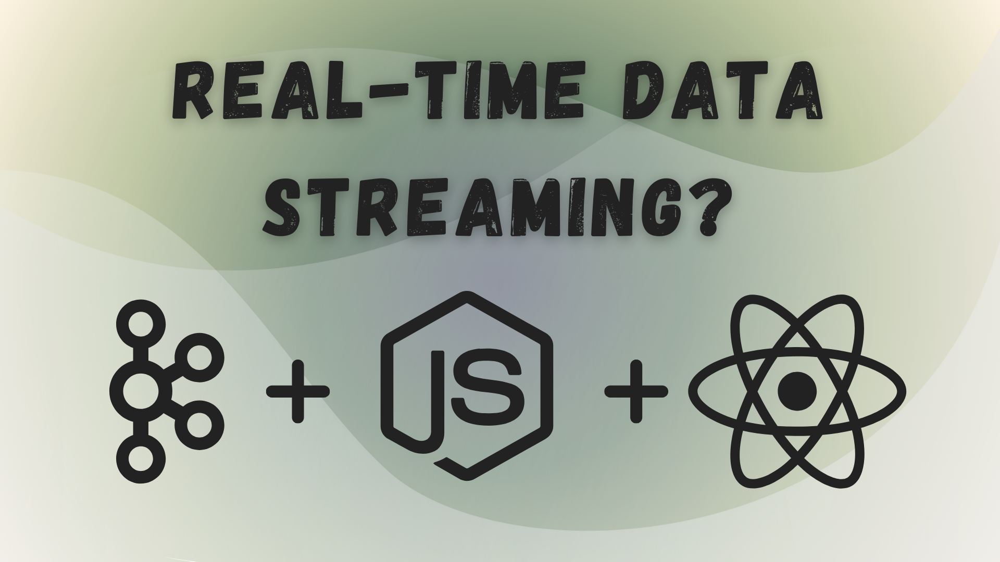

# Deploying Node App on Kubernetes Cluster

## >> Getting started



To get started with this project, run

```bash
git clone https://github.com/Vishakha-Sawra/kafka-nodejs-real-time-data-processing
```

## >> Navigate to backend directory and install dependencies:

```bash
cd backend
npm install
```

## >> Navigate to Frontend directory and install dependencies:

```bash
cd frontend
npm install
```

## >> Pull the Zookepper and Kafka

```bash
docker run -p 2181:2181 zookeeper
```

```bash
docker run -p 9092:9092 -e KAFKA_ZOOKEEPER_CONNECT=<ip-address>:2181 -e KAFKA_ADVERTISED_LISTENERS=PLAINTEXT://<ip-address>:9092 -e KAFKA_OFFSETS_TOPIC_REPLICATION_FACTOR=1 confluentinc/cp-kafka
```

## >> Follow the documentation:

https://fewv.dev/lessons/real-time-data-processing-using-kafka-nodejs/